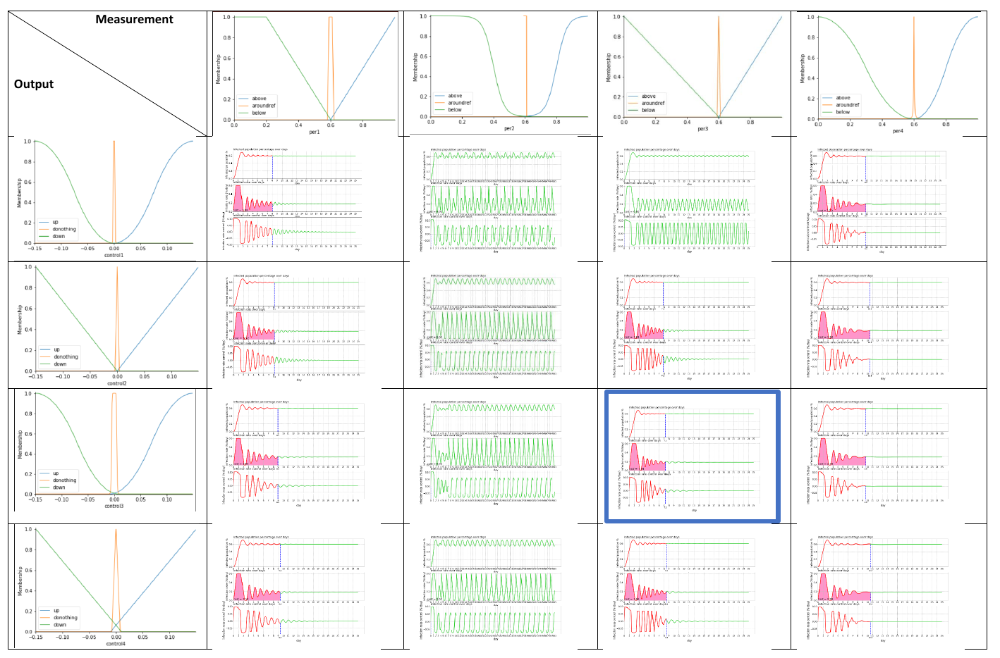
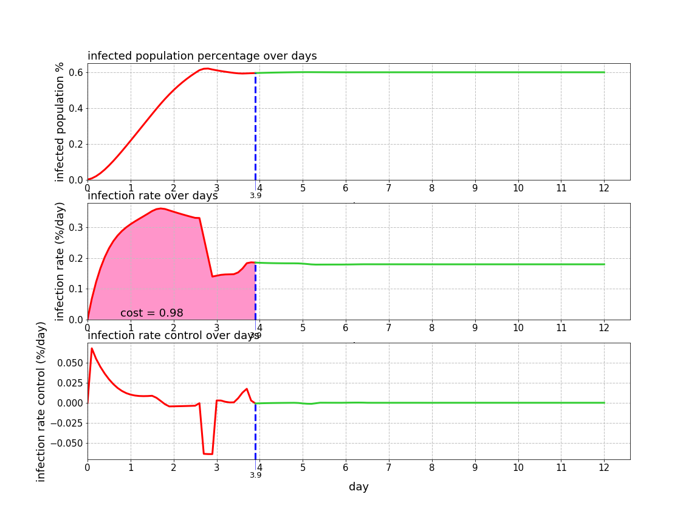

# Fuzzy Control for Plague Spread

This repository contains the implementation of a fuzzy controller for controlling the spread of a virus in an artificial world. The goal is to infect and maintain 60% of the bots in the world, leveraging fuzzy control techniques.

## **Part 1: Fuzzy Controller Design**

- **`fuzzy_control.ipynb`**: Jupyter notebook implementing the fuzzy controller without considering effective infection rate measurements.
- **`plague.py`**: Python module providing the **`Plague`** class for measurements and control of the infection rate.

## **Part 2: Enhanced Fuzzy Controller Design**

- **`fuzzy_control_effective.ipynb`**: Jupyter notebook updating the fuzzy controller to take effective infection rate measurements into account.
- **`plague.py`**: Python module providing the **`Plague`** class for measurements and control of the infection rate.

## **Results**

### Part 1

Table 1: Different Partitioning Strategies & Their Performance

|  | Per1 | Per2 | Per3 | Per4 |
| --- | --- | --- | --- | --- |
| Control1 | 1.88 | diverge | diverge | 2.19 |
| Control2 | 1.92 | diverge | 1.83 | 2.32 |
| Control3 | 2.03 | diverge | 1.74 | 2.15 |
| Control4 | 2.14 | diverge | 1.96 | 2.35 |

### Part 2

|  | Cost | Steady State, First Day |
| --- | --- | --- |
| Eff5 | Diverge | Diverge |
| Eff4 | 1.27 | 6.4 |
| Eff9 | 1.22 | 6 |
| Eff6 | Diverge | Diverge |
| Eff7 | 0.98 | 3.9 |
| Eff8 | 1.01 | 3.9 |

Eff7 Results

## **Instructions**

1. Open the respective notebook for the desired part to explore and implement the fuzzy controller design.
2. Run the notebook to observe the control of the infection rate and the spread of the virus.
3. Modify the fuzzy control rules and parameters to optimize the infection rate and achieve the desired equilibrium.
4. Experiment and analyze the results to gain insights into the dynamics of the plague control system.

Please refer to the notebooks for detailed explanations, performance metrics, visualizations, and code comments.

## **Contributions**

Contributions to this repository are welcome. Feel free to submit issues or pull requests for any enhancements or bug fixes.

## **License**

This project is licensed under the MIT License. See the **[LICENSE](https://chat.openai.com/LICENSE)** file for more information.